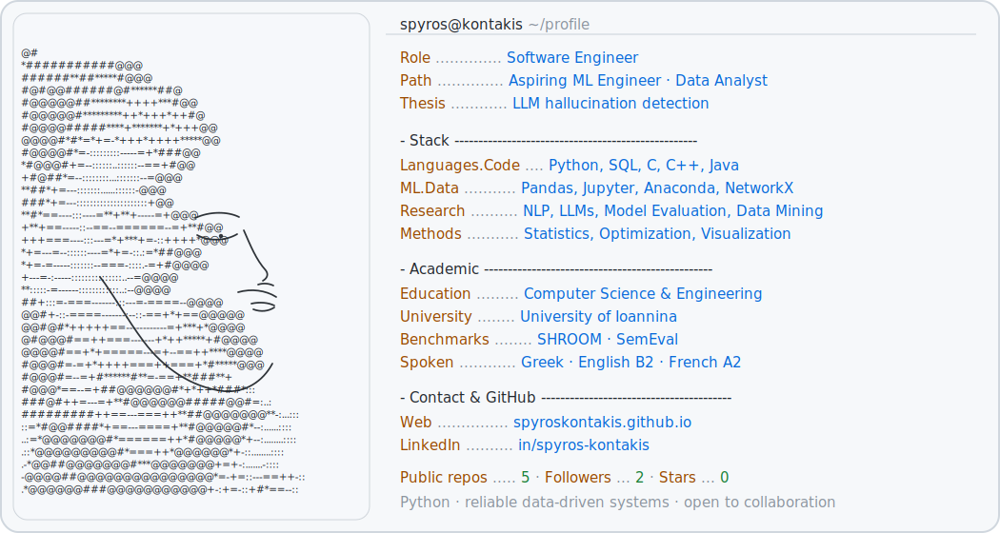

  <a href="https://spyroskontakis.github.io/" aria-label="Visit Spyros Kontakis' portfolio">
    <picture>
      <source media="(prefers-color-scheme: dark)" srcset="./dark_mode.svg">
      <source media="(prefers-color-scheme: light)" srcset="./light_mode.svg">
      
    </picture>
  </a>

   

  <a href="https://www.linkedin.com/in/spyros-kontakis/">LinkedIn</a>
  &nbsp;·&nbsp;
  <a href="https://spyroskontakis.github.io/">Portfolio</a>

<!--
Profile text is maintained in profile.toml.
The SVG files are generated by scripts/render_profile.py.
-->
